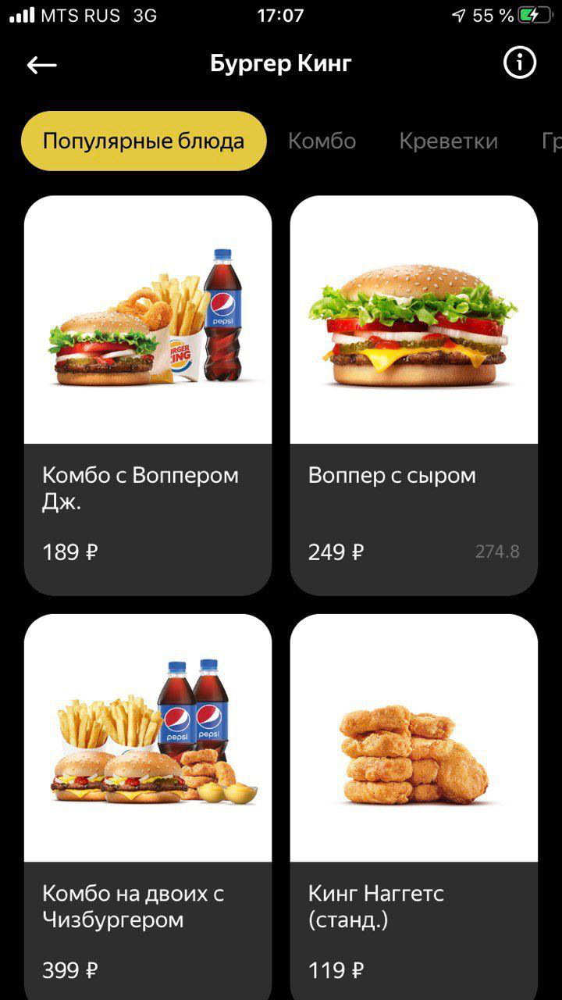
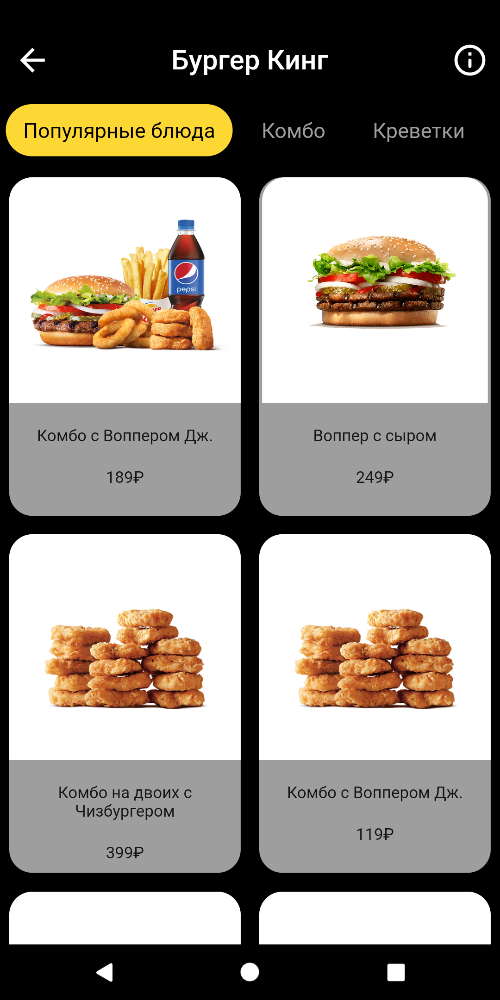

Разработать приложение - каталог службы доставки. Приложение состоит из одного экрана, на котором выводится список доступных для заказа блюд. 

На этом экране никакой логики - только верстка. Переход по категориям, добавление товара в заказ, открытие карточки товара - ничего из этого делать не нужно. Экран максимально декоративный.

<ul>
  <li> соответствие внешнего вида экрана скриншоту из задания (соблюдать размеры пиксель в пиксель не требуется; нужно придерживаться цветовой схемы, общей композиции и соотношения размеров и отступов);</li>
  <li> чистота и осмысленность кода.</li>
</ul>

